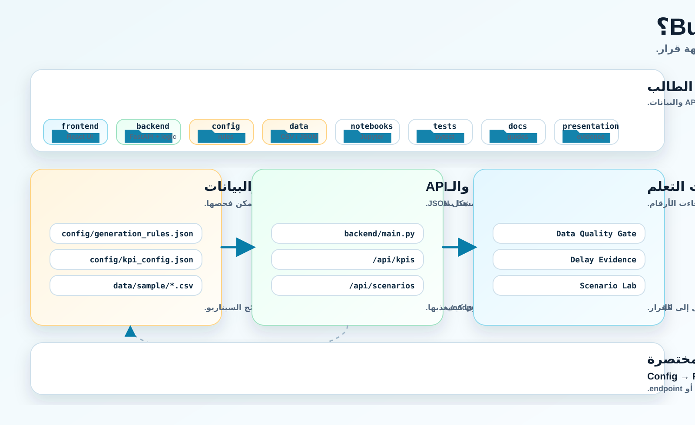

# Bus Delay DSS - Guide Page Section

This section is prepared for the mother training platform guide page. It explains what students are downloading, where they are inside the repo, and how the frontend talks to the backend.

## ما الذي يستلمه الطالب؟

هذا repo هو نموذج تطبيقي كامل لفريق Team B حول تأخر رحلات الحافلات وضعف الثقة في النقل العام. الهدف ليس أن يرى الطالب شاشة جاهزة فقط، بل أن يفهم كيف يتم بناء منتج برمجي صغير من البداية إلى النهاية:

- يتم تعريف المشكلة والقرار داخل ملفات `config/`.
- يتم توليد بيانات تشغيلية تجريبية داخل `data/`.
- يتم حساب المؤشرات والتحقق من جودة البيانات داخل `backend/`.
- يتم كشف النتائج من خلال FastAPI endpoints.
- تقرأ واجهة React هذه endpoints وتعرض صفحات DSS.
- يلتقط الطالب evidence من الواجهة والـAPI والاختبارات ليستخدمه في التقرير والعرض.

## الصورة التوضيحية

Use this image in the guide page:

```text
bus-delay-dss-team-b/frontend/public/assets/bus-dss-repo-map.svg
```



## كيف يقرأ الطالب repo؟

لا يبدأ الطالب من `frontend` فقط، ولا من `backend` فقط. الرحلة الصحيحة هي قراءة العلاقة بين الطبقات:

```text
Config -> Python Backend -> API Response -> React UI -> Evidence Screenshot -> Report
```

معنى ذلك أن كل رقم في الواجهة يجب أن يكون قابلا للتتبع:

- إذا ظهر `Average final delay` في الواجهة، يبحث الطالب عن مصدره في `backend/analysis.py` و`data/sample/trips.csv`.
- إذا ظهر تحذير جودة بيانات، يبحث الطالب عن قاعدته في `config/validation_rules.json` وعن تنفيذه في `backend/validation.py`.
- إذا ظهر سيناريو مثل `Organized Boarding`، يبحث الطالب عن افتراضاته في `config/scenarios.json` وعن حسابه في `backend/scenarios.py`.
- إذا ظهرت توصية نهائية، يربطها الطالب بـ`backend/recommendation.py` وبالبيانات التي سمحت أو منعت القرار.

## ما الذي يجب تشغيله؟

داخل repo:

```bash
pip install -r requirements.txt
python scripts/generate_sample_data.py
python -m pytest
uvicorn backend.main:app --reload
```

ثم في نافذة Terminal ثانية:

```bash
cd frontend
npm install
npm run dev
```

بعد تشغيل الواجهة، يبدأ الطالب من صفحات:

- `Project Entry`
- `Data Model`
- `Synthetic Data Lab`
- `Data Quality Gate`
- `Delay Evidence`
- `Scenario Lab`
- `Decision Recommendation`
- `Repo Structure`

## ماذا يجب أن يلاحظ الطالب؟

الواجهة ليست مجرد Dashboard. هي أداة تعلم full-stack. لذلك يوجد في الصفحات:

- API panels تعرض الطلب والاستجابة.
- Data Model يوضح الجداول والعلاقات.
- Quality Gate يوضح متى يسمح النظام بالتحليل ومتى يجب إيقاف التوصية.
- Scenario Lab يوضح الفرق بين baseline وsimulated scenario.
- Repo Structure يربط الصفحة بالملف الذي ينتجها.

## ملف التحميل

The clean downloadable zip should be created from the repo source, excluding `.git`, `node_modules`, `dist`, caches, and temporary generated folders.

Suggested file name:

```text
bus-delay-dss-team-b-student.zip
```
